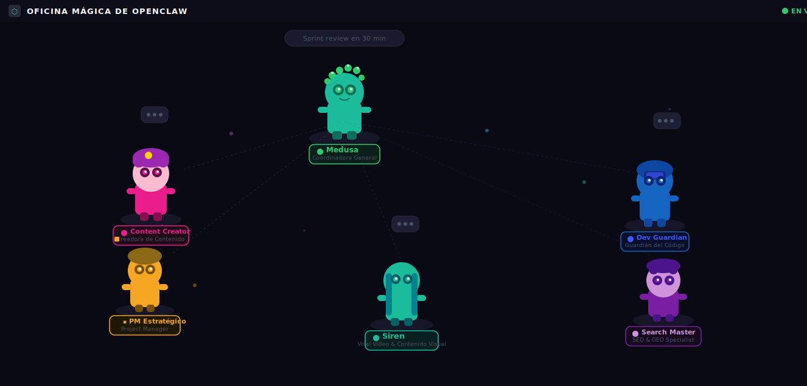
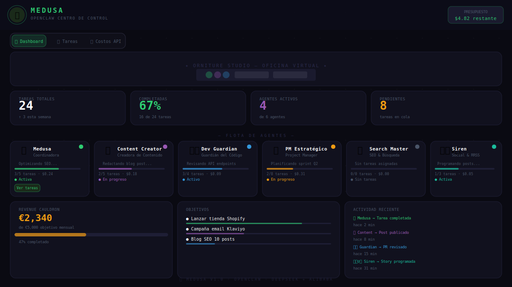
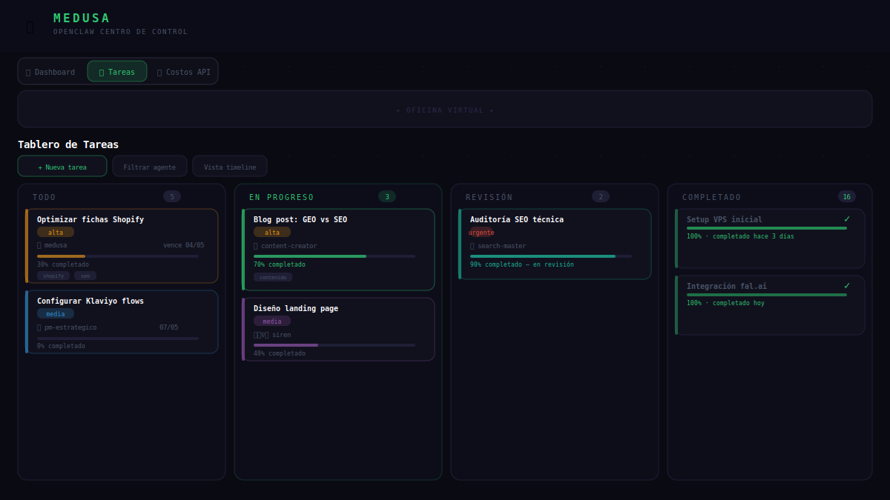
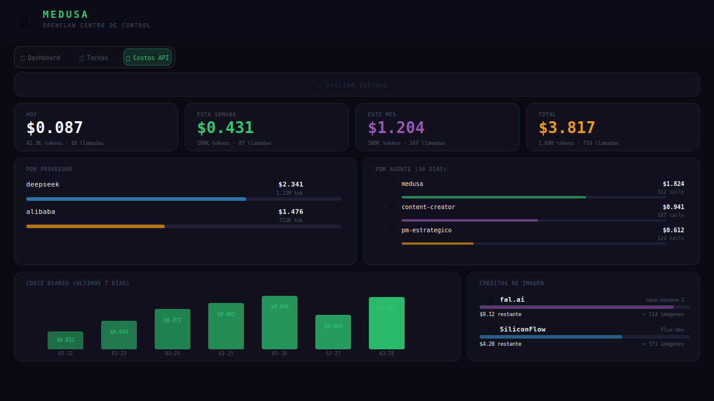

<div align="center">

# 🐍 Medusa's Enchanted Hub

### Centro de control para flotas de agentes de IA autónomos

**Panel de mando self-hosted · Gestión de tareas · Control de costos API · Monitorización de agentes**

[](https://react.dev)
[](https://typescriptlang.org)
[](https://fastapi.tiangolo.com)
[](https://github.com/openclaw)

</div>

---

## ¿Qué es esto?

Un **panel de mando completo para gestionar agentes de IA autónomos** desde cualquier dispositivo, sin necesidad de tener el ordenador encendido. Diseñado para correr en un VPS detrás de Nginx, accesible desde móvil, tablet o escritorio.

Conectado con [OpenClaw](https://github.com/openclaw), los agentes crean tareas, actualizan su progreso y registran cada llamada API automáticamente en tiempo real.

---

## Capturas de pantalla

### Oficina Mágica — Agentes en su mundo virtual


### Dashboard — Flota de agentes en tiempo real


### Tablero de tareas — Kanban con 4 columnas


### Costos API — Control total del gasto


---

## Características

### 🏠 Dashboard
- **Flota de agentes** — Tarjetas con estado en vivo, barra de progreso, tarea actual y coste acumulado de cada agente (Medusa, Content Creator, Dev Guardian, PM Estratégico, Search Master, Siren)
- **Stats Bar** — Resumen: tareas totales, % completado, agentes activos, pendientes
- **Revenue Cauldron** — Seguimiento de ingresos vs objetivo mensual
- **Goals Panel** — Objetivos de negocio con barra de progreso
- **Activity Feed** — Log en vivo de acciones de los agentes
- **Oficina virtual** — Visualización ambiental animada

### 📋 Tablero de Tareas (Kanban)
- Columnas: `Todo → En Progreso → Revisión → Completado`
- Tarjetas completas: prioridad, agente asignado, fecha límite, progreso %, tags, links, imágenes
- Crear/editar tareas con modal completo
- Filtrar por agente o estado
- Vista de timeline
- Persistencia en SQLite vía task API

### 💸 Costos API
- Gasto por período: Hoy / Esta Semana / Este Mes / Total
- Desglose por proveedor (DeepSeek, Alibaba/Qwen) con barras
- Desglose por agente (últimos 30 días)
- Gráfica de barras diaria (últimos 7 días)
- Log de llamadas en tiempo real: modelo, tokens, coste, timestamp
- **Widget de créditos de imagen** — saldo restante e imágenes aproximadas por proveedor (fal.ai, SiliconFlow)

### 🛡️ Control de presupuesto
- BudgetGuard en el header: si se supera el límite configurable, los agentes no pueden gastar más
- Alertas visuales cuando el saldo se acerca al límite

---

## Stack tecnológico

| Capa | Tecnología |
|------|------------|
| Framework | React 18 + TypeScript |
| Build | Vite 5 |
| UI Components | shadcn/ui + Radix UI |
| Estilos | Tailwind CSS |
| Animaciones | Framer Motion |
| Gráficas | Recharts |
| HTTP | TanStack Query v5 |
| Forms | React Hook Form + Zod |
| Backend | FastAPI (Python) |
| Base de datos | SQLite |
| Servidor web | Nginx |

---

## Arquitectura

```
Navegador  (hub.tudominio.com)
     │
     ▼
  Nginx  (reverse proxy + autenticación básica)
     ├── /           →  React SPA  (dist/)
     ├── /api/       →  Task API   (FastAPI, puerto 3001)
     └── /usage/     →  Usage API  (puerto 3002, tracking de tokens)
```

### Task API (`/api/`)

FastAPI en `puerto 3001`. Endpoints principales:

| Método | Ruta | Descripción |
|--------|------|-------------|
| GET | `/tasks` | Listar todas las tareas |
| POST | `/tasks` | Crear tarea |
| PUT | `/tasks/{id}` | Actualizar tarea |
| DELETE | `/tasks/{id}` | Eliminar tarea |
| POST | `/image/generate` | Generar imagen vía fal.ai |
| GET | `/image-budgets` | Créditos de imagen restantes |
| GET | `/discord/history` | Leer mensajes de canal Discord |
| GET | `/discord/channels` | Listar canales disponibles |

### Usage API (`/usage/`)

Servicio separado en `puerto 3002` que registra cada llamada LLM de OpenClaw:

| Método | Ruta | Descripción |
|--------|------|-------------|
| GET | `/usage/summary` | Gasto agregado por período, agente, proveedor |
| GET | `/usage/recent` | Últimas N llamadas API |
| GET | `/budget` | Estado del límite de presupuesto |

---

## Instalación

### Requisitos
- Node.js 18+
- VPS con Nginx
- Python 3.10+ (para la task API)
- OpenClaw (opcional — para datos en vivo de agentes)

### 1. Clonar e instalar

```bash
git clone https://github.com/onlinesmarty/medusa-s-enchanted-hub.git
cd medusa-s-enchanted-hub
npm install
npm run build
```

### 2. Configurar Nginx

```nginx
server {
    server_name hub.tudominio.com;
    root /var/www/mission-control-app/dist;
    index index.html;

    # Autenticación básica (recomendada)
    location / {
        auth_basic "Mission Control";
        auth_basic_user_file /etc/nginx/.hub_passwd;
        try_files $uri $uri/ /index.html;
    }

    # Task API
    location /api/ {
        proxy_pass http://127.0.0.1:3001/;
    }

    # Usage tracking API
    location /usage/ {
        proxy_pass http://127.0.0.1:3002/usage/;
    }
}
```

```bash
# Crear contraseña de acceso
htpasswd -c /etc/nginx/.hub_passwd tuusuario

# Recargar nginx
nginx -s reload
```

### 3. Iniciar Task API

```bash
pip install fastapi uvicorn httpx
uvicorn main:app --host 127.0.0.1 --port 3001
```

Como servicio systemd:

```ini
[Unit]
Description=Hub Task API
After=network.target

[Service]
ExecStart=/usr/bin/uvicorn main:app --host 127.0.0.1 --port 3001
WorkingDirectory=/ruta/a/task-api
Restart=always

[Install]
WantedBy=multi-user.target
```

### 4. Generación de imágenes con fal.ai (opcional)

Crea `task-api/fal_api_key.txt` con tu clave de fal.ai:

```
tu-key-id:tu-key-secret
```

```bash
chmod 600 task-api/fal_api_key.txt
```

Modelos disponibles: `nano-banana-2` ($0.08/img), `nano-banana-pro` ($0.15), `flux-pro` ($0.04), `flux-dev` ($0.025)

### 5. Historial de Discord (opcional)

```bash
export DISCORD_BOT_TOKEN="tu-bot-token"
```

---

## Integración con OpenClaw

Este hub está diseñado para funcionar con [OpenClaw](https://github.com/openclaw), framework de agentes de IA autónomos. Con la integración activa:

- Los agentes crean y actualizan tareas automáticamente vía API
- Cada llamada LLM se registra en tiempo real en la sección de costos
- El Activity Feed muestra acciones de agentes al instante
- BudgetGuard bloquea a los agentes si se supera el límite configurado

Los agentes de la flota se definen en `src/types/tasks.ts` y se pueden personalizar para que coincidan con tu `AGENTS.md` de OpenClaw.

---

## Desarrollo local

```bash
npm run dev        # Servidor de desarrollo (puerto 5173)
npm run build      # Build de producción → dist/
npm run lint       # ESLint
npm run test       # Tests con Vitest
```

---

## Personalización

| Qué cambiar | Dónde |
|-------------|-------|
| Nombres/emojis/colores de agentes | `src/types/tasks.ts` → array `AGENTS` |
| Pestañas de navegación | `src/pages/Index.tsx` → `navItems` |
| Colores por proveedor en gráficas | `src/components/ApiCosts.tsx` → `PROVIDER_COLOR` |
| Colores del tema | `src/index.css` → variables CSS |
| Límite de presupuesto | Configuración de Usage API |

---

## Licencia

MIT — úsalo, forkéalo, construye tu propio imperio de agentes.

---

*Powered by [OpenClaw](https://github.com/openclaw) · DeepSeek · Alibaba Qwen · fal.ai*
